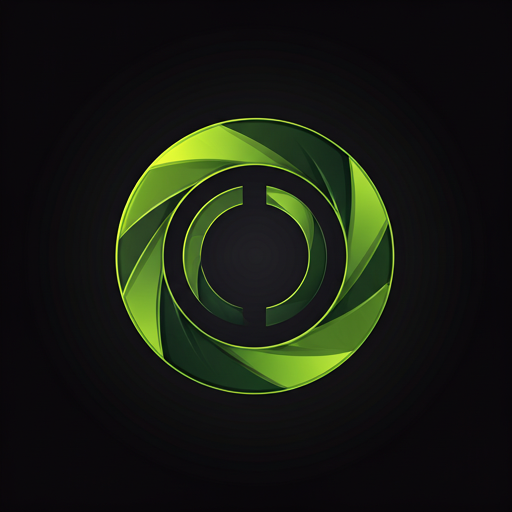

# CoreGym - Smart Fitness & Nutrition Tracker

<div align="center">
  
  <p>
    <strong>CoreGym</strong> — Your intelligent fitness companion with AI-powered workout generation
  </p>
  <p>
    
    
    
    
  </p>
</div>

---

## Overview

**CoreGym** is a comprehensive fitness and nutrition tracking application built with Flutter and Supabase. It provides an all-in-one solution for workout logging, nutrition tracking, progress visualization, and personalized AI-generated workout plans.

The app supports **English and Arabic** languages out of the box, featuring a premium dark-themed glassmorphic UI with smooth animations and haptic feedback.

---

## Features

### 1. AI-Powered Smart Trainer

The standout feature of CoreGym is the **Smart Trainer** that generates personalized workout plans based on:

- **Mood Selection** — Choose from 5 energy levels (Tired, Light, Medium, Energetic, Full Power) to adjust workout intensity
- **Target Muscles** — Multi-select from 8 muscle groups (Chest, Back, Shoulders, Biceps, Triceps, Legs, Abs, Cardio)
- **Duration** — Select workout length (30, 45, 60, or 90 minutes)

The AI automatically:
- Selects appropriate exercises from a database of 48+ exercises
- Adjusts sets, reps, and rest times based on your mood
- Includes warm-up exercises
- Provides motivational messages in Arabic

### 2. Workout Tracking

- **Exercise Library** — Browse exercises organized by muscle group with YouTube video tutorials
- **My Program** — View and start your active workout program
- **Programs Library** — Explore preset training programs (Push Pull Legs, Upper/Lower, Full Body, Bro Split)
- **Detailed Logging** — Log sets, weights, and reps during workouts
- **YouTube Integration** — Watch exercise tutorial videos directly in the app
- **Rest Timer** — Built-in countdown timer between sets

### 3. Nutrition Tracking

- **Daily Macros Dashboard** — Track calories, protein, carbs, and fat against your goals
- **Food Search** — Search the database for foods to log
- **Meal Categorization** — Log meals into Breakfast, Lunch, Dinner, and Snacks
- **Calorie Rings** — Beautiful animated progress rings showing daily consumption
- **Weekly History** — View past 7 days of nutrition data with charts

### 4. Progress & Analytics

- **Body Measurements** — Track weight, body fat %, and key metrics over time
- **1RM Progress** — Monitor your estimated one-rep max improvements
- **Workout History** — View completed workouts with detailed set logs
- **Volume Tracking** — Calculate total training volume (kg)

### 5. Profile & Goals

- **Personal Information** — Age, weight, height, gender
- **Goal Setting** — Weight loss, muscle gain, endurance, flexibility, or general fitness
- **Daily Targets** — Personalized calorie and protein goals
- **Activity Level** — Sedentary to extra active settings

---

## Tech Stack

| Component | Technology |
|-----------|------------|
| **Framework** | Flutter 3.8+ |
| **Language** | Dart |
| **Backend** | Supabase (PostgreSQL, Auth, Realtime) |
| **State Management** | Provider |
| **Charts** | fl_chart |
| **Video** | youtube_player_flutter |
| **Localization** | flutter_localizations + intl |
| **Animations** | AnimationController, Built-in Flutter animations |
| **UI** | Custom glassmorphic components, Material Design 3 |

---

## Project Structure

```
lib/
├── main.dart                     # App entry point
├── fitness_home_pages.dart       # Home screen with daily summary
├── login_sign_up.dart            # Authentication screens
├── profile.dart                  # User profile & settings
├── progrems.dart                 # Programs browsing
├── forgetpassword.dart           # Password recovery
├── gender.dart                   # Gender selection
├── splashscreen.dart            # Splash screen
│
├── l10n/                        # Localization (ARB files)
│   ├── app_en.arb               # English strings
│   ├── app_ar.arb               # Arabic strings
│   └── app_localizations.dart   # Generated localization
│
├── providers/                    # State management
│   └── locale_provider.dart      # Language settings
│
├── screens/                     # App screens
│   ├── workout_screen.dart      # Workout tab container
│   ├── workout_tabs/
│   │   ├── log_workout_tab.dart     # Exercise logging
│   │   ├── my_program_tab.dart       # Active program
│   │   └── programs_library_tab.dart # Program browser
│   ├── nutrition_screen.dart    # Nutrition tracking
│   ├── progress_screen.dart      # Progress & analytics
│   ├── onboarding_flow.dart      # New user onboarding
│   ├── fitness_coach_screen.dart # AI workout generator
│   └── exercise_detail_sheet.dart # Exercise details + logging
│
├── services/                    # Business logic
│   ├── supabase_client.dart     # Supabase connection
│   ├── supabase_config.dart     # Configuration
│   ├── supabase_exports.dart    # Re-exports
│   ├── auth_service.dart        # Authentication
│   ├── profile_service.dart     # Profile management
│   ├── stats_service.dart      # Statistics
│   ├── workout_service.dart     # Workout operations
│   ├── nutrition_service.dart    # Nutrition operations
│   ├── measurements_service.dart # Body measurements
│   ├── onboarding_service.dart  # Onboarding flow
│   ├── fitness_plan_generator.dart # AI plan generation
│   ├── fitness_coach_service.dart  # Coach utilities
│   └── exercise_database.dart  # Exercise data
│
├── supabase/                   # Supabase related
│   ├── supabase_config.dart
│   ├── auth_service.dart
│   ├── stats_service.dart
│   ├── profile_service.dart
│   └── supabase_exports.dart
│
├── theme/                      # UI theming
│   ├── app_colors.dart         # Color palette
│   └── app_text.dart           # Typography
│
└── widgets/                    # Reusable components
    ├── core_gym_navbar.dart    # Bottom navigation
    ├── home_header.dart        # Home screen header
    └── language_toggle.dart    # Language switcher
```

---

## Database Schema (Supabase)

The app uses the following main tables:

- `profiles` — User profile data (weight, height, goals)
- `exercises` — Exercise library with muscle groups
- `workout_sessions` — Individual workout records
- `workout_sets` — Sets logged within sessions
- `nutrition_logs` — Food consumption entries
- `daily_summary` — Aggregated daily stats
- `body_measurements` — Body metric history
- `personal_records` — 1RM and best records

---

## Installation

### Prerequisites

- Flutter SDK >= 3.8.0
- Dart SDK
- A Supabase project with the required tables created

### Setup

1. **Clone the repository**
   ```bash
   git clone <repository-url>
   cd coregymali
   ```

2. **Install dependencies**
   ```bash
   flutter pub get
   ```

3. **Configure Supabase**
   - Create a project at [supabase.com](https://supabase.com)
   - Run the SQL migrations to create required tables
   - Update `lib/services/supabase_client.dart` with your project URL and anon key

4. **Generate app icons** (optional)
   ```bash
   flutter pub run flutter_launcher_icons
   ```

5. **Run the app**
   ```bash
   flutter run
   ```

---

## Localization

The app is fully localized into **English** and **Arabic**. To add a new language:

1. Create a new ARB file in `lib/l10n/` (e.g., `app_fr.arb`)
2. Add the locale to `l10n.yaml`:
   ```yaml
   arb-dir: lib/l10n
   template-arb-file: app_en.arb
   output-localization-file: app_localizations.dart
   ```
3. Run `flutter gen-l10n` to regenerate localization files

---

## Building for Production

### Android
```bash
flutter build apk --release
```

### iOS
```bash
flutter build ios --release
```

---

## Screenshots

The app features:
- 🎨 Dark theme with neon green accents (#D4FF57)
- 🌊 Glassmorphic navigation bar
- 📊 Animated progress charts and rings
- 🎬 Embedded YouTube player for exercise tutorials
- ⏱️ Rest timer with notifications
- 🔄 Smooth page transitions and micro-animations

---

## License

This project is proprietary and confidential. All rights reserved.

---

## Author

Developed with ❤️ using Flutter

**CoreGym** — Ignite Your Fitness Journey 💪
