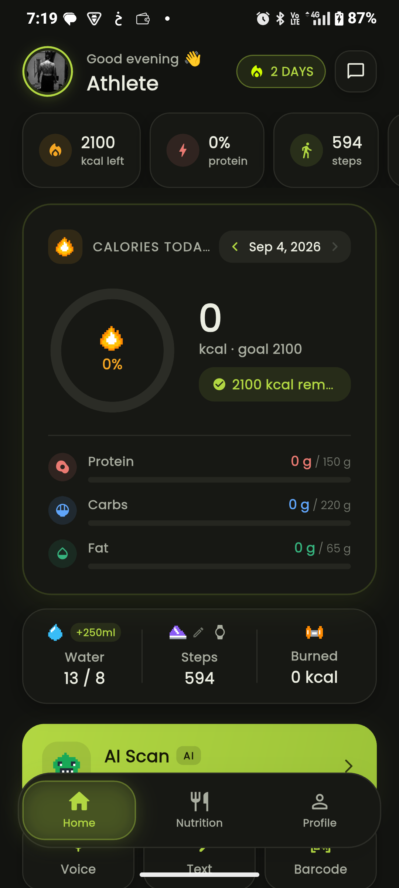
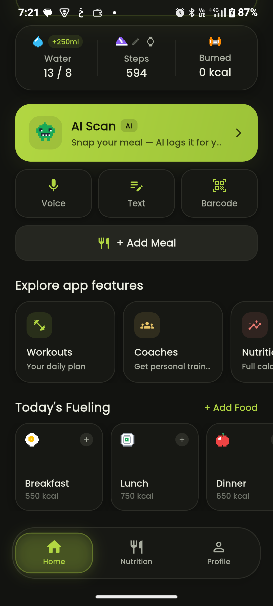
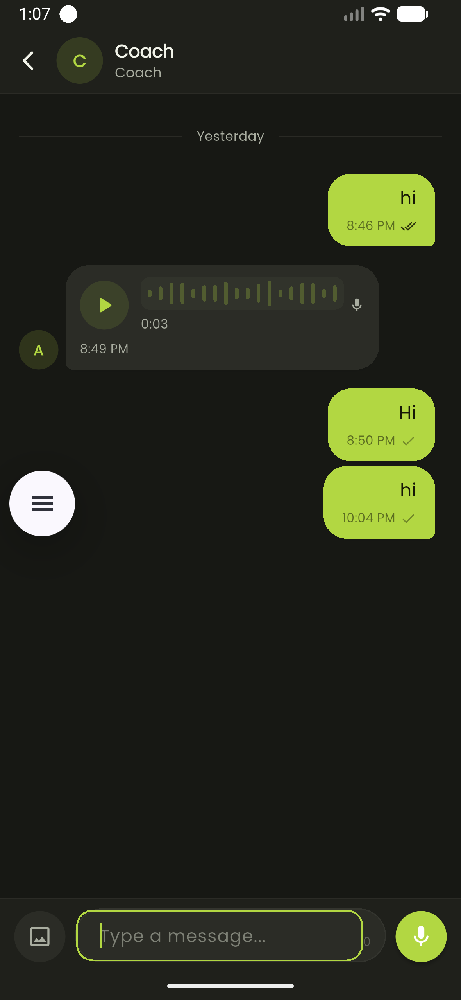

<div align="center">


# 💪 CoreGym — Smart Fitness & Nutrition Tracker

### Your intelligent fitness companion — AI-powered logging, real coaches, and smart reminders
**رفيقك الذكي لللياقة — تسجيل ذكي بالذكاء الاصطناعي، كوتشز حقيقيون، وتنبيهات مميزة**


</div>

---

<p align="center">
  
  
  
</p>
<p align="center"><i>Home · AI logging hub · Coach chat with voice notes</i></p>

---

## 🗺️ Table of Contents

- [What is CoreGym?](#-what-is-coregym)
- [Key Features](#-key-features)
- [Push Notification System](#-push-notification-system-onesignal)
- [Design System — Graphite & Soft Volt](#-design-system--graphite--soft-volt)
- [Tech Stack](#%EF%B8%8F-tech-stack)
- [Project Structure](#-project-structure)
- [Supabase Backend](#%EF%B8%8F-supabase-backend)
- [Getting Started](#-getting-started)
- [Security](#-security)
- [Testing](#-testing)
- [Localization](#-localization)
- [Building for Production](#-building-for-production)
- [Roadmap](#%EF%B8%8F-roadmap)
- [FAQ](#-faq)
- [License](#-license)

---

## 🤔 What is CoreGym?

<details open>
<summary><strong>New here? Click for a plain-English explanation 👇</strong></summary>

<br/>

Picture having all of this in your pocket:

- A **nutrition coach** who can look at a photo of your meal — or just listen to you describe it — and instantly calculate the calories, protein, and carbs.
- A **personal trainer** who builds you a workout plan based on your mood and how much time you have.
- A **smartwatch companion** that tracks your steps, heart rate, and calories burned.
- A **marketplace of real human coaches** you can message (voice, photos, PDFs) and subscribe to.
- **Smart reminders** that nudge you to log meals, drink water, and stay inside your calorie goal.

CoreGym brings all of that together in one bilingual app (English / العربية, with full RTL). It's built with **Flutter**, runs on a serverless **Supabase** backend, understands food with **Google Gemini**, delivers pushes with **OneSignal**, and takes payments with **Stripe**.

</details>

---

## ✨ Key Features

### 1. 🧠 AI Food Logging — front and center

The AI experience is the hero of the Home screen — a full-width gradient banner, not a buried menu item:

| Mode | How it works |
|---|---|
| 📷 **AI Scan** | Snap a photo → Gemini vision analysis (Edge Function) → review → save |
| 🎤 **Voice** | Describe your meal by voice → Gemini parses the audio directly → review → save |
| ⌨️ **Text** | Type what you ate (*"٢ بيض و عيش بلدي"*) → AI extracts items & macros |
| 🏷️ **Barcode** | Scan any product → instant nutrition lookup → serving-size picker |

All paths write to one `nutrition_logs` table with real macros. The seeded food database ships with **~319 Egyptian foods** (كشري، فول، طعمية…) for instant manual search & browse.

### 2. 🍽️ Nutrition Tracking

- Daily calorie gauge with over-goal states and remaining/over pills
- Protein / carbs / fat progress rows with semantic colors
- Water tracking with quick-add and local every-2-hour reminders
- Weekly history charts, per-meal editing (quantity × multipliers), quick-calories entry
- Date-aware logging — entries are attributed to the day you're viewing

### 3. 🏋️ Workout Tracking

- **AI Smart Trainer** — generates a session from mood (5 energy levels) × target muscles (8 groups) × duration (30–90 min), from a 48+ exercise library with YouTube tutorials
- **Programs Library** — preset programs (PPL, Upper/Lower, Full Body, Bro Split) with difficulty/goal filters
- **Live sessions** — set-by-set logging (warm-up / drop-set / failure flags), rest timers, automatic session persistence
- **My Program** — active-program tracking, real per-day progress
- Streaks with badges, 1RM / personal-record tracking, volume analytics

### 4. ⌚ Health & Wearable Integration

Syncs automatically with **Apple HealthKit** and **Google Health Connect** — steps, active/total calories, heart rate, workout minutes. See [HEALTH_INTEGRATION.md](HEALTH_INTEGRATION.md).

### 5. 📈 Progress & Analytics

Body measurements over time, weight charts, RM progress per exercise, weekly calories/steps/workout charts with goal percentages.

### 6. 🧑‍🏫 Coach Marketplace

- Coaches publish profiles, media galleries, certifications (PDFs), and reviews
- Members browse, view details, and subscribe with **Stripe** (Checkout → webhook → verified status endpoint)
- Coach dashboard with client management and data (a dedicated web dashboard is on the roadmap)

### 7. 💬 Realtime Chat

Member ↔ coach messaging built on Supabase Realtime:

- 🎤 **Voice notes** — in-app recorder with waveform playback bubbles
- 🖼️ **Images** — camera/gallery, compressed upload, pinch-zoom full-screen viewer
- 📄 **PDFs** — in-app viewer with download
- Read receipts (✓ / ✓✓), per-conversation unread counts, optimistic sending
- All attachments live in **private storage buckets** with participant-only RLS

### 8. 👤 Profile, Goals & Themes

- Multi-step onboarding with live BMI, TDEE-based calorie/macro targets
- Email/password and Google Sign-In
- **System / Light / Dark** theme switch (Profile → Appearance), persisted

---

## 🔔 Push Notification System (OneSignal)

Every reminder respects per-user preferences (`notification_preferences`) and quiet hours — a missing preferences row means everything is ON. Users are targeted by their **Supabase auth id**, registered as OneSignal's `external_id` alias on every sign-in path, so the server never manages device tokens.

| # | Notification | Trigger | Delivery | Status |
|---|---|---|---|---|
| 1 | **Welcome** | After account creation (email & first-time Google) | Server push via Edge Function, bilingual EN/AR — device language picks | ✅ Live |
| 2 | **Meal reminder** | `pg_cron` at 08:00 / 14:00 / 20:00 (Cairo) — only if nothing logged that day | Server push, per-window dedupe | ✅ Live |
| 3 | **Water reminder** | Every 2 hours, 08:00 → 22:00 | **Local** notifications — works offline; stops once the daily water goal is reached | ✅ Live |
| 4 | **Calorie alert** | Crossing ~90% of the daily calorie goal | Event-triggered server push, once per day | 🚧 In progress |
| 5 | **Chat message** | New message → push to the other participant with a deep-link into the conversation | Server push + tap-through routing | 🚧 In progress |
| 6 | **In-app inbox** | Bell icon + unread badge + history screen | Reads `notification_log` | 🚧 In progress |

Every server push is logged into `notification_log` (the in-app history) with type and deep-link payload.

---

## 🎨 Design System — "Graphite & Soft Volt"

A calm-but-energetic identity tuned for extended daily use — no pure-black OLED strain, no neon fatigue. The original Electric Volt (`#D1FC00`) survives only as a micro-accent (the streak flame 🔥).

| Token | Dark | Light |
|---|---|---|
| Background | `#121310` olive-graphite | `#F2F3E9` warm sage paper |
| Surfaces | `#171814` → `#31322C` | `#FBFCF5` + soft shadows |
| Primary (fills) | `#B2D742` muted lime | `#B2D742` + ink text `#161806` |
| Primary (accent) | `#B2D742` | `#506B1A` (darkened for WCAG AA) |
| Secondary / Tertiary | `#4FD1C5` teal / `#E8C468` gold | `#0F766E` / `#8A6A1E` |
| Text hierarchy | `#ECEEE2` / `#A9ADA0` / `#70746A` | `#1B1D12` / `#555947` / `#83877A` |

- **Mode-aware tokens** — every color flows through static `AppColors` fields re-resolved by `AppColors.apply(Brightness)`; widgets never hardcode hex
- Semantic maps for muscle groups / difficulty / goals in `AppSemanticColors`; macro & data-viz accents are mode-safe constants
- Typography: **Poppins** (EN) / **Cairo** (AR) via `google_fonts`; full RTL mirroring

---

## 🛠️ Tech Stack

| Component | Technology |
|---|---|
| **Frontend** | Flutter 3.x / Dart 3.x |
| **Backend** | Supabase — Postgres + RLS, Edge Functions (Deno), Storage, Realtime, pg_cron, Vault |
| **Push** | OneSignal SDK 5.5.2 (server pushes via REST) + `flutter_local_notifications` (local water nudges) |
| **Payments** | Stripe — Checkout Sessions, webhooks, verified status endpoint |
| **AI** | Google Gemini (vision + audio food analysis) |
| **State** | Provider (ChangeNotifiers) + Riverpod |
| **Charts / Fonts** | fl_chart · google_fonts |
| **Media** | image_picker, record, just_audio, photo_view, flutter_pdfview, cached_network_image, mobile_scanner, youtube_player_flutter |
| **Health** | health package (HealthKit / Health Connect) |
| **i18n** | flutter_localizations + intl (EN / AR) |

---

## 📁 Project Structure

<details open>
<summary><strong>Key layout</strong></summary>

```
lib/
├── main.dart                       # Bootstrap: Supabase, OneSignal, providers, dual themes
├── theme/                          # AppColors (mode-aware) · AppText · AppSemanticColors
├── l10n/                           # ARB files + generated localizations (en/ar)
├── providers/                      # Locale · Profile · ThemeMode (ChangeNotifiers)
├── services/                       # Nutrition · Workout · Stats · Streak · Health
│   ├── notification_service.dart   #   OneSignal wrapper (single SDK choke-point)
│   └── water_reminder_service.dart #   Local every-2h water nudges
├── screens/                        # Home shell · nutrition · scan/voice/text/barcode logging
│   └── workout_tabs/               # Library · My Program · Log
├── features/
│   ├── coach/                      # Marketplace · detail · dashboard · media (clean arch)
│   ├── chat/                       # domain/ data/ presentation/ — realtime chat
│   ├── health/                     # Wearable sync
│   └── notifications/              # In-app inbox UI
├── chat/                           # Chat entities / repositories / providers
├── models/                         # Food scan / barcode / voice log results
├── supabase/                       # Config + auth service
└── widgets/                        # Shared cards, state views, charts, sheets

supabase/
├── functions/                      # 9 Deno edge functions + _shared/onesignal.ts helper
└── migrations/                     # RLS, subscriptions, chat storage buckets, notification tables

docs/screenshots/                   # Screenshots used in this README
```

</details>

---

## 🗄️ Supabase Backend

<details>
<summary><strong>Database tables (click)</strong></summary>

| Table | What it stores |
|---|---|
| `profiles`, `onboarding`, `user_goals` | Users, onboarding answers, daily targets |
| `nutrition_logs`, `foods` | Food entries per meal/day; seeded + custom foods |
| `food_scans`, `voice_food_log_items` | AI scan & voice results |
| `workout_sessions`, `workout_sets` | Workout records |
| `body_measurements`, `daily_activity`, `daily_summary` | Measurements, health sync, per-day rollups (trigger-maintained) |
| `coach_profiles`, `coach_media`, `coach_subscriptions` | Coach marketplace |
| `conversations`, `messages` | Realtime chat (text / voice / image / file) |
| `subscriptions` | Stripe subscription state |
| `notification_preferences`, `notification_log` | Reminder settings & in-app notification history |

**Views:** `weekly_progress`, `weight_progress`, `personal_records`
**Migrations:** [`supabase/migrations/`](supabase/migrations/)

</details>

<details>
<summary><strong>Edge Functions (click)</strong></summary>

| Function | Purpose |
|---|---|
| `analyze-food` | Gemini vision analysis of meal photos |
| `log-food-text` | Gemini text parsing (*"دجاج و رز"*) → log entries |
| `log-food-voice` | Gemini audio analysis; uploads audio + saves logs server-side |
| `lookup-barcode` | Product lookup by barcode |
| `create-checkout-session` | Stripe Checkout session creation |
| `stripe-webhook` | Subscription state sync from Stripe events |
| `get-subscription-status` | Verified current-subscription check |
| `send-notification` | OneSignal push helper (user self-push or server `x-admin-key`) |
| `send-meal-reminders` | Cron-driven meal nudges (see notifications table above) |

Shared OneSignal helper: [`supabase/functions/_shared/onesignal.ts`](supabase/functions/_shared/onesignal.ts)

</details>

<details>
<summary><strong>Storage buckets (click)</strong></summary>

| Bucket | Access |
|---|---|
| `chat-voice-notes`, `chat-images`, `chat-files` | Private — participants of the conversation only (RLS on folder = conversation id) |
| `food-scans`, `voice-food-logs` | Private — owner only |
| `avatars`, `coach-media`, `coach-pdfs` | Public read |

</details>

**Scheduled jobs (pg_cron):** meal reminders (`0 6,12,18 * * *` UTC = 8ص/2م/8م Cairo) and a monthly streak-freeze reset. Cron calls authenticate with a Vault-stored secret header.

---

## 🚀 Getting Started

> Follow these steps in order.

**Prerequisites**
- ✅ Flutter SDK ≥ 3.8
- ✅ A Supabase project · a OneSignal app (Android platform configured) · a Stripe account
- ✅ Android SDK — minSdk 26, **core library desugaring enabled** (required by local notifications)

### 1 · Clone & install
```bash
git clone https://github.com/alimohammedassi/coregymali.git
cd coregymali
flutter pub get
```

### 2 · Configure the app
Fill in `lib/supabase/supabase_config.dart`:

```dart
static const String supabaseUrl     = 'https://<ref>.supabase.co';
static const String supabaseAnonKey = '<anon-key>';    // public by design
static const String oneSignalAppId  = '<onesignal-app-id>';
```

### 3 · Database
Run the SQL files in [`supabase/migrations/`](supabase/migrations/) in order via the Supabase SQL Editor (RLS policies, chat buckets, notification tables).

### 4 · Edge Function secrets (server-side only — never in the app)
```bash
supabase secrets set \
  ONESIGNAL_APP_ID=<app-id> \
  ONESIGNAL_REST_API_KEY=<rest-key> \
  ADMIN_API_KEY=<random-32-byte-hex> \
  CRON_SECRET=<random-32-byte-hex> \
  STRIPE_SECRET_KEY=<sk_test|live> \
  GEMINI_API_KEY=<gemini-key>
```

### 5 · Deploy Edge Functions
```bash
supabase functions deploy analyze-food log-food-text log-food-voice lookup-barcode
supabase functions deploy create-checkout-session get-subscription-status stripe-webhook
supabase functions deploy send-notification
supabase functions deploy send-meal-reminders --no-verify-jwt   # cron-authenticated instead
```

### 6 · Schedule the cron job
```sql
select vault.create_secret('<random-32-byte-hex>', 'coregym_cron_secret');

select cron.schedule('coregym-meal-reminders', '0 6,12,18 * * *', $$  -- 8ص/2م/8م Cairo
  select net.http_post(
    url := 'https://<ref>.supabase.co/functions/v1/send-meal-reminders',
    headers := jsonb_build_object('Content-Type','application/json',
      'x-cron-secret', (select decrypted_secret from vault.decrypted_secrets
                         where name = 'coregym_cron_secret')),
    body := '{}'::jsonb)
$$);
```

### 7 · Run
```bash
flutter run
```

---

## 🔐 Security

- **Row Level Security** on user-scoped tables; `notification_log` inserts happen only server-side (service role)
- REST / admin / cron keys live in **Supabase secrets & Vault** — the app ships only the anon key
- `send-notification` accepts a signed-in user JWT (**self-push only**) or the server `x-admin-key`
- Stripe webhooks verify signatures; subscription status is re-verified server-side against the JWT
- Private chat buckets enforce participant-only access via storage RLS

---

## 🧪 Testing

```bash
flutter analyze   # 0 errors (pre-existing lint infos only)
flutter test      # 9 passing: food-search ranking (EN/AR), workout logging contract, coach dashboard smoke
```

Features shipped in this repository were **live-tested on real Android hardware** — push delivery confirmed end-to-end through OneSignal (welcome + meal reminders + water scheduling verified via logcat), chat voice/image/PDF round-trips, and Stripe checkout flows.

---

## 🌐 Localization

Fully localized into **English** and **Arabic** with RTL layout switching. To add a language:

1. Create a new ARB file in `lib/l10n/` (e.g. `app_fr.arb`)
2. Add the locale to `supportedLocales` in `lib/main.dart`
3. Run `flutter gen-l10n`

---

## 📦 Building for Production

```bash
flutter build apk --release     # Android
flutter build ios --release     # iOS
```

> **Notes:** Health integration requires the HealthKit capability (iOS) and Health Connect permissions in `AndroidManifest.xml` (see [HEALTH_INTEGRATION.md](HEALTH_INTEGRATION.md)). Android builds require core library desugaring (already configured). iOS rich-push Notification Service Extension is on the roadmap.

---

## 🗺️ Roadmap

- [ ] Calorie-limit alert (~90% of daily goal) — event-triggered push
- [ ] Chat push notifications + tap-to-open-conversation deep-linking
- [ ] In-app notification inbox (bell + unread badge)
- [ ] Coach dashboard → dedicated web app
- [ ] iOS Notification Service Extension (rich media pushes)

---

## ❓ FAQ

<details>
<summary><strong>Does the app need an internet connection all the time?</strong></summary>

Most features (AI food scanning, chat, payments, server reminders) rely on Supabase and Gemini online. Water reminders are local and work offline.
</details>

<details>
<summary><strong>What's the difference between the AI Smart Trainer and the Coach Marketplace?</strong></summary>

The AI Smart Trainer instantly generates a workout plan with no human involved. The Coach Marketplace connects you with a real human coach you can message (voice/photos/PDFs) and subscribe to.
</details>

<details>
<summary><strong>How do notifications find me without managing device tokens?</strong></summary>

The app tags your OneSignal user with your Supabase auth id (`external_id`). Server functions target that id — OneSignal handles every device and platform detail.
</details>

---

## 📚 Additional Documentation

- [HEALTH_INTEGRATION.md](HEALTH_INTEGRATION.md) — Wearable/health data sync
- [VOICE_FOOD_LOG_SUPABASE_SETUP.md](VOICE_FOOD_LOG_SUPABASE_SETUP.md) — Voice logging schema & wiring
- [MIGRATE_TO_SUPABASE.md](MIGRATE_TO_SUPABASE.md) — Backend migration notes
- [CHAT_IMPLEMENTATION.md](CHAT_IMPLEMENTATION.md) — Chat system: send-bug fix, voice/image/PDF sharing

---

## 📄 License

This project is proprietary and confidential. All rights reserved.
