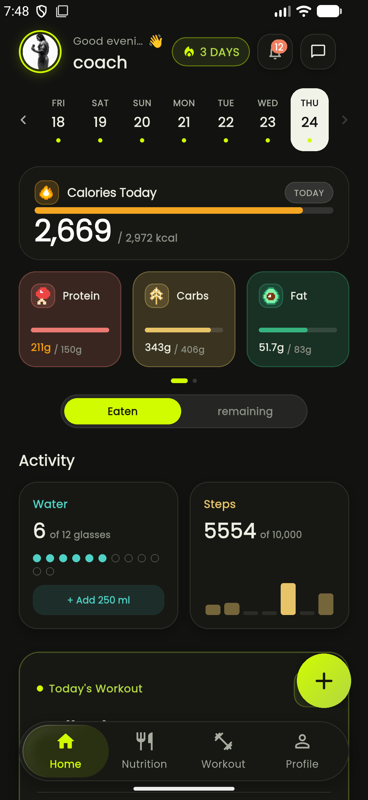
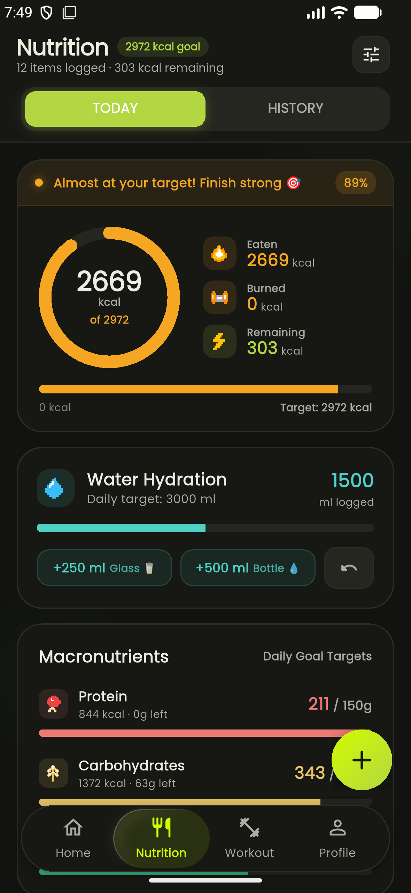
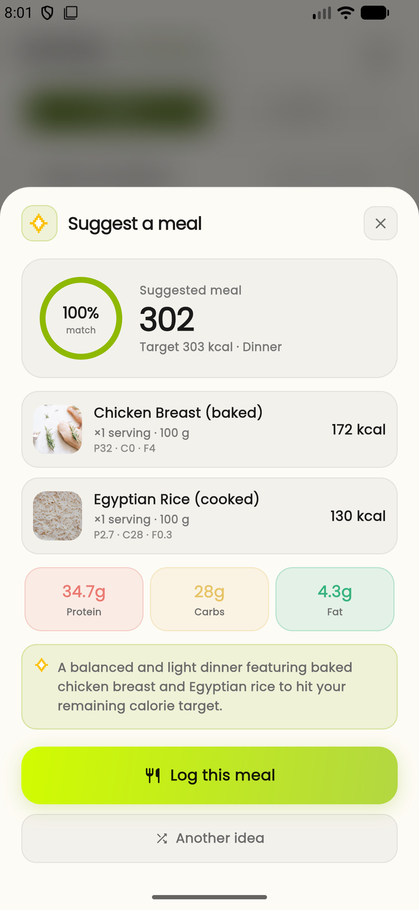
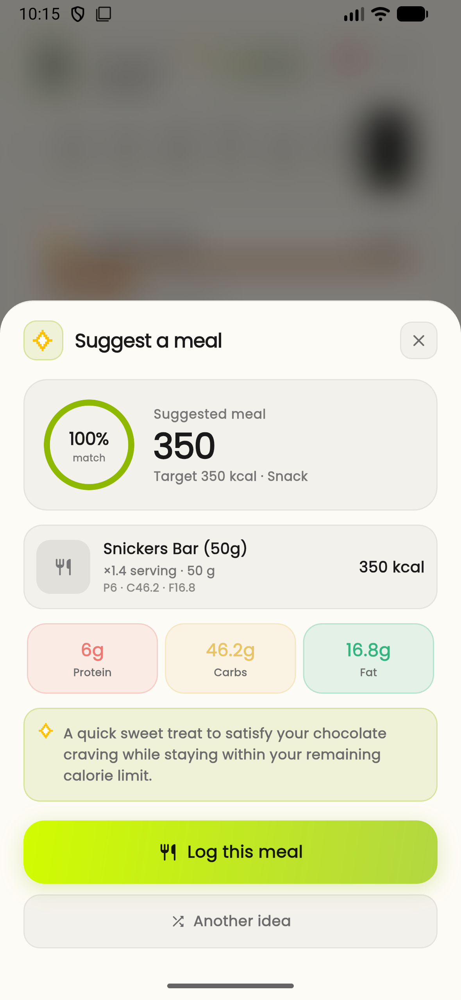
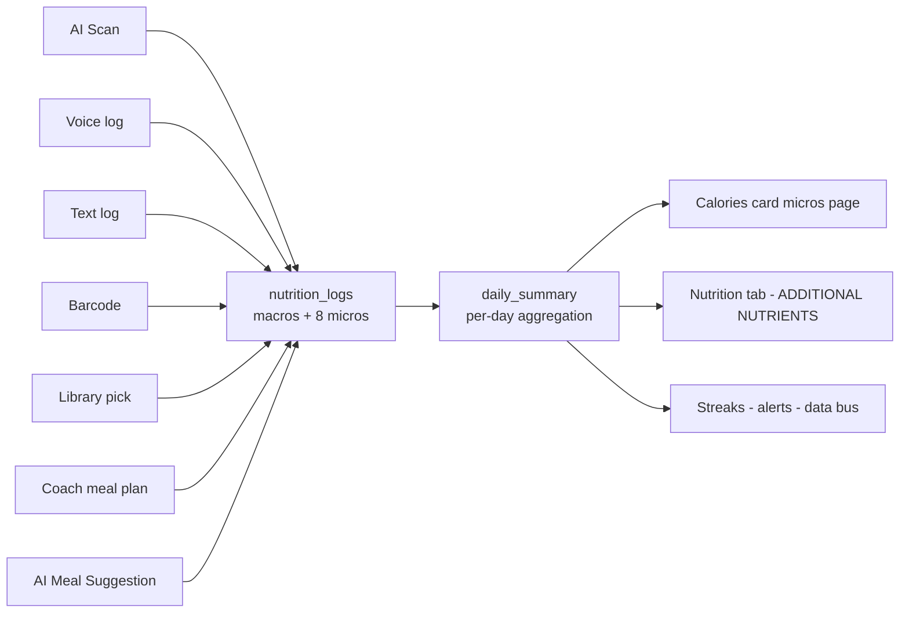
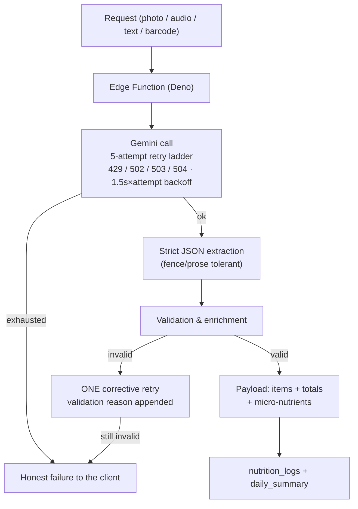
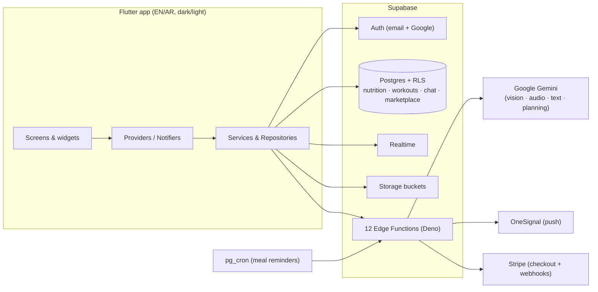

<div align="center">


# 💪 CoreGym — Smart Fitness & Nutrition Tracker

### Your intelligent fitness companion — AI-powered logging, AI meal planning, real coaches, and smart reminders
**رفيقك الذكي لللياقة — تسجيل ذكي بالذكاء الاصطناعي، تخطيط وجبات بالـ AI، كوتشز حقيقيون، وتنبيهات مميزة**


</div>

---

<p align="center">
  
  
  
  
</p>
<p align="center"><i>Home · Nutrition · AI Meal Suggestion (98% match) · Treat mode — a Snickers that still fits your day</i></p>

---

## 🗺️ Table of Contents

- [What is CoreGym?](#-what-is-coregym)
- [The Four Pillars](#-the-four-pillars)
- [Key Features](#-key-features)
- [AI Meal Suggestion — the flagship](#-ai-meal-suggestion--the-flagship)
- [Micro-Nutrient Pipeline](#-micro-nutrient-pipeline)
- [AI & Data Intelligence](#-ai--data-intelligence)
- [Push Notification System](#-push-notification-system-onesignal)
- [Design System — Graphite & Soft Volt v2.1](#-design-system--graphite--soft-volt-v21)
- [Architecture](#%EF%B8%8F-architecture)
- [Tech Stack](#%EF%B8%8F-tech-stack)
- [Project Structure](#-project-structure)
- [Supabase Backend](#%EF%B8%8F-supabase-backend)
- [Getting Started](#-getting-started)
- [Environment Variables & Secrets](#-environment-variables--secrets)
- [Security](#-security)
- [Testing](#-testing)
- [Performance](#-performance)
- [Localization](#-localization)
- [Building for Production](#-building-for-production)
- [Roadmap](#%EF%B8%8F-roadmap)
- [Known Limitations](#-known-limitations)
- [FAQ](#-faq)
- [Additional Documentation](#-additional-documentation)
- [License](#-license)

---

## 🤔 What is CoreGym?

<details open>
<summary><strong>New here? Click for a plain-English explanation 👇</strong></summary>

<br/>

Picture having all of this in your pocket:

- A **nutrition coach** who can look at a photo of your meal — or just listen to you describe it — and instantly calculate the calories, protein, carbs, and even the fiber/sugar/sodium.
- An **AI meal planner** that doesn't just count what you ate — it *builds* your next meal (or your guilty-pleasure snack) to fit exactly what's left of your day.
- A **personal trainer** who builds you a workout plan based on your mood and how much time you have — or a real coach who assigns one to you.
- A **smartwatch companion** that tracks your steps, heart rate, and calories burned.
- A **marketplace of real human coaches** you can message (voice, photos, PDFs) and subscribe to.
- **Smart reminders** that nudge you to log meals, drink water, and stay inside your calorie goal.

CoreGym brings all of that together in one bilingual app (English / العربية, with full RTL). It's built with **Flutter**, runs on a serverless **Supabase** backend, understands food with **Google Gemini**, delivers pushes with **OneSignal**, and takes payments with **Stripe**.

Unlike a generic calorie counter, CoreGym is built around three pillars working together: **AI-assisted logging** (so tracking takes seconds, not minutes), **real human coaching** (so users aren't left alone with a spreadsheet), and **habit reinforcement** (streaks, reminders, and progress visualization that make consistency the easy choice).

</details>

---

## 🧭 The Four Pillars

| | Pillar | What it means in the app |
|---|---|---|
| 🍽️ | **Nutrition** | 446+ food catalog with photos, 5 AI logging modes, full macro **and** micro-nutrient tracking, weekly history, per-meal editing |
| 🏋️ | **Training** | AI Smart Trainer, programs library, coach-assigned workouts & meal plans, live set-by-set sessions |
| 🧑‍🏫 | **Coaching** | Coach marketplace, Stripe subscriptions, realtime chat with voice/images/PDFs, community leaderboard |
| 🔁 | **Habits** | Streaks, smart push + local reminders, water & steps tracking, progress analytics |

---

## ✨ Key Features

### 1. 🧠 AI Food Logging — front and center

The AI experience is the hero of the Home screen — a volt-gradient hub above the nav bar, not a buried menu item:

| Mode | How it works |
|---|---|
| 📷 **AI Scan** | Snap a photo → Gemini vision analysis (Edge Function) → review → save |
| 🎤 **Voice** | Describe your meal by voice → Gemini parses the audio directly → review → save |
| ⌨️ **Text** | Type what you ate (*"٢ بيض و عيش بلدي"*) → AI extracts items & macros |
| 🏷️ **Barcode** | Scan any product → instant nutrition lookup → serving-size picker |
| 🪄 **Suggest a meal** | Let the AI *build* your next meal — see the [flagship section](#-ai-meal-suggestion--the-flagship) below |

All paths write to one `nutrition_logs` table with full macros **and micro-nutrients** (fiber, sugars, sodium, potassium, calcium, iron, cholesterol, caffeine). The seeded food database ships with **446+ Egyptian & global foods** (كشري، فول، طعمية، شيبسي، سنيكرز…) — 430 of them with real dish photography — for instant manual search & browse. Regional coverage keeps AI results accurate for dishes that generic Western food databases usually mislabel or miss entirely.

### 2. 🍽️ Nutrition Tracking

- Daily calories card: animated gauge, eaten/remaining toggle, over-goal warning states
- Protein / carbs / fat cards + a **micro-nutrients page** (fiber · sugars · sodium) fed by every logging path
- Water tracking with quick-add and local every-2-hour reminders (8ص → 10م)
- Weekly history charts, per-meal editing (quantity × multipliers), quick-calories entry
- Date-aware logging — entries are attributed to the day you're viewing, not just "today"
- **Coach-assigned meal plans** — your coach builds the plan on the web dashboard; you tap "ate it" and everything (macros, streak, alerts) flows through the same pipeline

### 3. 🏋️ Workout Tracking

- **AI Smart Trainer** — generates a session from mood (5 energy levels) × target muscles (8 groups) × duration (30–90 min), from a 48+ exercise library with YouTube tutorials
- **Programs Library** — preset programs (PPL, Upper/Lower, Full Body, Bro Split) with difficulty/goal filters
- **Coach-assigned workouts** — appear as a card on Home; skip / start / finish writes duration & completion back to the coach dashboard
- **Live sessions** — set-by-set logging (warm-up / drop-set / failure flags), rest timers, automatic session persistence
- **My Program** — active-program tracking, real per-day progress
- Streaks with badges, 1RM / personal-record tracking, volume analytics

### 4. ⌚ Health & Wearable Integration

Syncs automatically with **Apple HealthKit** and **Google Health Connect** — steps, active/total calories, heart rate, workout minutes. Sync is permission-gated and quiet: it runs in the background on Home load with a hard timeout, so a slow or denied health-plugin call never stalls the UI. See [HEALTH_INTEGRATION.md](HEALTH_INTEGRATION.md).

### 5. 📈 Progress & Community

Body measurements over time, weight charts, RM progress per exercise, weekly calories/steps/workout charts with goal percentages — plus a **community leaderboard** (60% calories + 40% water scoring) and rich client profile pages (activity heatmap, daily/weekly/cumulative charts).

### 6. 🧑‍🏫 Coach Marketplace

- Coaches publish profiles, media galleries, certifications (PDFs), and reviews
- Members browse, view details, and subscribe with **Stripe** (Checkout → webhook → verified status endpoint)
- Coach-side management (clients, workout & meal assignment, subscription approval) runs on the **external Core Dashboard web app** — the mobile app stays member-focused

### 7. 💬 Realtime Chat

Member ↔ coach messaging built on Supabase Realtime:

- 🎤 **Voice notes** — in-app recorder with waveform playback bubbles
- 🖼️ **Images** — camera/gallery, compressed upload, pinch-zoom full-screen viewer
- 📄 **PDFs** — in-app viewer with download
- Read receipts (✓ / ✓✓), per-conversation unread counts, optimistic sending
- All attachments live in **private storage buckets** with participant-only RLS

### 8. 👤 Profile, Goals & Themes

- Multi-step onboarding with live BMI, TDEE-based calorie/macro targets
- Email/password and Google Sign-In
- **System / Light / Dark** theme switch (Profile → Appearance), persisted
- Animated splash with capsule-collision reveal, locale-aware (كور جيم / CoreGym)

---

## 🪄 AI Meal Suggestion — the flagship

The newest pillar feature. Instead of only *counting* what you ate, CoreGym's AI **composes** your next meal from the real foods catalog — sized to exactly what your day can still take.

<details open>
<summary><strong>How the flow works (tap to expand the anatomy)</strong></summary>

1. **Choose** — a remaining-budget hero (big kcal number + colored macro pills), a meal-slot picker (default picked by time of day), a style grid, and a **custom calorie target field** (80–5000 kcal) that overrides everything when typed.
2. **Loading** — a 4-step story bar that mirrors what the server really does: *read remaining → scan catalog → compose → validate*.
3. **Result** — an animated kcal count-up, a **match-accuracy ring** (honest: it mirrors the server's ±10% tolerance), item cards with catalog photos and per-serving math, macro badges, a bilingual explanation — and a one-tap **Log this meal** that writes through the exact same pipeline as manual logging.
4. **Error** — honest, per-type messaging (no calorie room / no fitting meal / service busy), with retry where it makes sense.

</details>

**Five styles** steer the composition:

| Style | What the AI leans on |
|---|---|
| ⚖️ **Balanced** | protein + carb + fat/vegetable structure, 2–4 items |
| 🥩 **High protein** | protein & dairy items covering a big share of remaining protein |
| 🥗 **Light** | vegetables, fruits, dairy — airy, not calorie-dense |
| 🏠 **Home-style** | Egyptian home dishes and everyday staples |
| 🍫 **Junk food** | the deliberately unhealthy one — chocolate bars, chips, sugary drinks… **still sized to your calorie target**, so it fits the diet instead of breaking it |

<p align="center">
  
  
</p>

**Built-in variety:** the server shuffles its per-category menu slices on every request, so two suggestions in a row are genuinely different meals — not the same chicken and rice on loop.

**One-tap logging with full honesty:** every suggested item lands in `nutrition_logs` through the standard `logFood` path — streaks, alerts, the data bus, and the micro-nutrient pipeline all behave exactly like a manual log.

---

## 🧬 Micro-Nutrient Pipeline

Macros are table stakes — CoreGym tracks **8 micro-nutrients** (fiber, sugars, sodium, potassium, calcium, iron, cholesterol, caffeine) end-to-end, from *every* logging path:


```mermaid
flowchart LR
    A[AI Scan] --> L
    B[Voice log] --> L
    C[Text log] --> L
    D[Barcode] --> L
    E[Library pick] --> L
    F[Coach meal plan] --> L
    G[AI Meal Suggestion] --> L
    L[nutrition_logs<br/>macros + 8 micros] --> S[daily_summary<br/>per-day aggregation]
    S --> U[Calories card micros page]
    S --> V[Nutrition tab - ADDITIONAL NUTRIENTS]
    S --> W[Streaks - alerts - data bus]
```

Design rules the pipeline enforces everywhere:

- **Unknown ≠ 0.** A missing value stays SQL `NULL` through every insert path; it only becomes a number at the aggregation step.
- **AI values are estimates, catalog values are facts.** Scans/voice/text carry AI-estimated micros (required best estimates, null only for water/black coffee); library and suggestion items scale **catalog** values by the exact quantity ratio.
- **Coach meal plans are no exception.** Assigned-meal logging pulls the catalog row for the (possibly substituted) food and scales micros by the effective-calories ratio — so a client-edited portion still reports proportional fiber/sodium.

---

## 🤖 AI & Data Intelligence

<details open>
<summary><strong>The AI logging pipeline (click to collapse)</strong></summary>


```mermaid
flowchart TD
    IN["Request (photo / audio / text / barcode)"] --> EF["Edge Function (Deno)"]
    EF --> R["Gemini call<br/>5-attempt retry ladder<br/>429 / 502 / 503 / 504 · 1.5s×attempt backoff"]
    R -->|"ok"| J["Strict JSON extraction<br/>(fence/prose tolerant)"]
    R -->|"exhausted"| E["Honest failure to the client"]
    J --> V["Validation & enrichment"]
    V -->|"invalid"| V2["ONE corrective retry<br/>validation reason appended"]
    V2 -->|"still invalid"| E
    V -->|"valid"| P["Payload: items + totals<br/>+ micro-nutrients"]
    P --> DB["nutrition_logs + daily_summary"]
```

</details>

**Principles that make the AI trustworthy:**

- **Never trust the model's numbers.** For catalog-backed features (suggestions, library), totals are *recomputed from the catalog* server-side — the model picks items and quantities, the database does the math.
- **No silent fallbacks.** If Gemini can't produce a valid answer after the retry ladder, the app says so — it never guesses or quietly substitutes another model.
- **Two quota pools.** Food analysis runs on one Gemini model pool; meal suggestion deliberately runs on `gemini-3.5-flash-lite`, its own free-tier pool — so a burst of meal planning can't starve food logging.
- **Shared-RPM protection.** The client disables in-flight requests and guards against double-fires, so the ~20 RPM free tier stays healthy under normal use.
- **Structured output, defensively parsed.** `responseMimeType: application/json` plus a fence/prose-tolerant extractor and a strict validator (real catalog ids only, sane multipliers, duplicate rejection, ±10% calorie window).

---

## 🔔 Push Notification System (OneSignal)

Every reminder respects per-user preferences (`notification_preferences`) and quiet hours — a missing preferences row means everything is ON. Users are targeted by their **Supabase auth id**, registered as OneSignal's `external_id` alias on every sign-in path, so the server never manages device tokens.

| # | Notification | Trigger | Delivery | Status |
|---|---|---|---|---|
| 1 | **Welcome** | After account creation (email & first-time Google) | Server push via Edge Function, bilingual EN/AR — device language picks | ✅ Live |
| 2 | **Meal reminder** | `pg_cron` at 08:00 / 14:00 / 20:00 (Cairo) — only if nothing logged that day | Server push, per-window dedupe | ✅ Live |
| 3 | **Water reminder** | Every 2 hours, 08:00 → 22:00 | **Local** notifications — works offline; stops once the daily water goal is reached | ✅ Live |
| 4 | **Calorie alert** | Crossing ~90% of the daily calorie goal | Event-triggered server push, once per day | ✅ Live |
| 5 | **Chat message** | New message → push to the other participant | Server push (`send-chat-push`) | ✅ Live |
| 6 | **In-app inbox** | Bell icon + unread badge + history screen | Reads `notification_log` | ✅ Live |

Every server push is logged into `notification_log` (the in-app history) with type and deep-link payload.

---

## 🎨 Design System — "Graphite & Soft Volt" v2.1

A calm-but-energetic identity tuned for extended daily use — no pure-black OLED strain, no neon fatigue. The original Electric Volt (`#D1FC00`) survives as the **accent** (progress rings, active states) on dark, darkened to `#8FB800` on light; buttons and fills use the muted soft-volt lime with near-black ink.

| Token | Dark | Light |
|---|---|---|
| Background | `#121310` olive-graphite | `#F6F3EB` warm cream paper |
| Surfaces | `#171814` → `#31322C` ladder | `#FDFBF5` cream cards + soft shadows |
| Accent (rings/active) | `#D1FC00` volt | `#8FB800` darkened volt |
| Primary fills | `#B2D742` soft volt + ink `#161806` | same, WCAG-tuned |
| Secondary / Tertiary | `#4FD1C5` teal / `#E8C468` gold | `#0F766E` / `#8A6A1E` |
| Macro family | protein `#EA7A72` · carbs `#E8C468` · fat `#36B37E` · calories `#F5A623` | mode-safe constants |

- **Mode-aware tokens** — every color flows through static `AppColors` fields re-resolved by `AppColors.apply(Brightness)`; widgets never hardcode hex
- **One anatomy for cards** — tinted-fill outlined surfaces (`_tintFill`/`_tintBorder`) + squircle icon badges shared by the calories card, nutrient cards, and the suggestion sheet
- **8pt spacing scale** (`AppSpacing`) and a fixed type scale (`AppText`) — Poppins (EN) / Cairo (AR) via `google_fonts`, full RTL mirroring
- Data-viz accents form one coherent mid-saturation family — carbs are gold, not blue; fiber is teal; no hue collisions with water/teal

---

## 🏗️ Architecture

CoreGym mixes two patterns depending on the maturity of the feature:

- **Newer / larger features** (`features/coach`, `features/chat`, `features/health`) follow **Clean Architecture**: a `domain` layer (entities, repository interfaces), a `data` layer (Supabase-backed repository implementations, DTOs), and a `presentation` layer (screens, `ChangeNotifier`-based providers).
- **Older / simpler screens** (`screens/`, `services/`) use a lighter service-layer pattern — a `services/` class wraps Supabase calls directly and screens consume it through `Provider`.

State management is **Provider** (`ChangeNotifier`) throughout, with **Riverpod** available for newer state that benefits from finer-grained rebuild scoping.

<details open>
<summary><strong>System diagram (click to collapse)</strong></summary>


```mermaid
flowchart LR
    subgraph App["Flutter app (EN/AR, dark/light)"]
        UI["Screens & widgets"]
        P["Providers / Notifiers"]
        S["Services & Repositories"]
        UI --> P --> S
    end

    subgraph SB["Supabase"]
        AU["Auth (email + Google)"]
        PG[("Postgres + RLS<br/>nutrition · workouts · chat · marketplace")]
        RT["Realtime"]
        ST["Storage buckets"]
        EF["12 Edge Functions (Deno)"]
    end

    S --> AU
    S --> PG
    S --> RT
    S --> ST
    S --> EF

    EF --> GEM["Google Gemini<br/>(vision · audio · text · planning)"]
    EF --> OS["OneSignal (push)"]
    EF --> STR["Stripe (checkout + webhooks)"]
    CRON["pg_cron (meal reminders)"] --> EF
```

</details>

Data flows one way: **UI → Notifier/Provider → Repository (or Service) → Supabase**, with `ChangeNotifier.notifyListeners()` triggering scoped rebuilds back up the tree. Nutrition writes additionally fire a static **data bus** so the Home widgets refresh within ~250 ms of any save path — including saves that happen inside the Nutrition tab.

---

## 🛠️ Tech Stack

| Component | Technology |
|---|---|
| **Frontend** | Flutter ≥3.8 / Dart ^3.8.1 |
| **Backend** | Supabase — Postgres + RLS, 12 Edge Functions (Deno), Storage, Realtime, pg_cron, Vault |
| **AI** | Google Gemini — vision, audio, text parsing, and meal planning |
| **Push** | OneSignal SDK 5.5.2 (server pushes via REST) + `flutter_local_notifications` (local water nudges) |
| **Payments** | Stripe — Checkout Sessions, webhooks, verified status endpoint |
| **State** | Provider (ChangeNotifiers) + Riverpod |
| **Charts / Fonts** | fl_chart · google_fonts (Poppins / Cairo) |
| **Media** | image_picker, record, just_audio, photo_view, flutter_pdfview, cached_network_image, mobile_scanner, youtube_player_flutter |
| **Health** | health package (HealthKit / Health Connect) |
| **i18n** | flutter_localizations + gen-l10n (EN / AR, full RTL) |

---

## 📁 Project Structure

<details>
<summary><strong>Key layout (click)</strong></summary>

```
lib/
├── main.dart                       # Bootstrap: Supabase, OneSignal, providers, dual themes
├── theme/                          # AppColors (mode-aware) · AppText · AppSpacing
├── l10n/                           # ARB files (en/ar) + generated localizations
├── providers/                      # Locale · Profile · ThemeMode (ChangeNotifiers)
├── services/
│   ├── nutrition_service.dart      # Logging, catalog, daily-summary aggregation, data bus
│   ├── assigned_nutrition_service.dart  # Coach meal plans: eat/skip/complete + micros
│   ├── meal_suggestion_service.dart     # suggest-meal client (typed errors)
│   ├── notification_service.dart   # OneSignal wrapper (single SDK choke-point)
│   └── water_reminder_service.dart # Local every-2h water nudges
├── screens/                        # Home shell · nutrition · scan/voice/text/barcode
│   ├── workout_tabs/               # Library · My Program · Log
│   └── leaderboard_screen.dart     # Community ranking
├── widgets/
│   ├── food_log_fab.dart           # Volt FAB + glass AI hub (all tabs)
│   ├── suggest_meal_sheet.dart     # AI meal suggestion flow (4 stages)
│   ├── food/glass_calories_card.dart    # Calories card + macro/micro pages
│   └── ...                         # Shared cards, state views, charts, sheets
├── features/
│   ├── coach/                      # Marketplace · detail (clean arch)
│   ├── chat/                       # domain/ data/ presentation/ — realtime chat
│   └── health/                     # Wearable sync
├── models/                         # Meal suggestion · nutrients · scan/barcode results
└── supabase/                       # Config + auth service

supabase/
├── functions/                      # 12 Deno edge functions + _shared/onesignal.ts
└── migrations/                     # RLS, chat buckets, notifications, seeds, data fixes

docs/
├── PROJECT_MASTER.md               # AI-handoff master document (architecture & rules)
├── APP_WORKFLOW.md                 # Full user-flow map (nav sections evolving)
└── screenshots/                    # Screenshots used in this README
```

</details>

---

## 🗄️ Supabase Backend

<details>
<summary><strong>Database tables (click)</strong></summary>

| Table | What it stores |
|---|---|
| `profiles`, `onboarding`, `user_goals` | Users, onboarding answers, daily calorie/macro targets |
| `foods` | 446+ seeded catalog rows (macros **+ 8 micro columns**, per-serving values, images) |
| `nutrition_logs` | Food entries per meal/day — macros **+ micros**, catalog or AI sourced |
| `daily_summary` | Per-day rollup maintained by the app aggregation path (calories, macros, micros) |
| `food_scans`, `voice_food_log_items` | AI scan & voice results |
| `nutrition_assignments` (+ meal/food rows) | Coach-assigned meal plans: snapshot values, client edits, substitutions, completion |
| `workout_sessions`, `workout_sets` | Workout records |
| `nutrition_change_log` | Audit trail of assigned-plan actions |
| `body_measurements`, `daily_activity` | Measurements, health sync |
| `coach_profiles`, `coach_media`, `reviews` | Coach marketplace |
| `conversations`, `messages` | Realtime chat (text / voice / image / file) |
| `subscriptions` | Stripe subscription state (partial unique index: one active subscription per client) |
| `notification_preferences`, `notification_log` | Reminder settings & in-app notification history |

**RPCs / views:** `get_leaderboard` (60% calories + 40% water), `get_user_activity`, `weekly_progress`, `weight_progress`, `personal_records`
**Migrations:** [`supabase/migrations/`](supabase/migrations/) — including idempotent seed and data-fix migrations

</details>

<details>
<summary><strong>Edge Functions — all 13 (click)</strong></summary>

| Function | Purpose |
|---|---|
| `analyze-food` | Gemini vision analysis of meal photos |
| `log-food-text` | Gemini text parsing (*"دجاج و رز"*) → log entries |
| `log-food-voice` | Gemini audio analysis; uploads audio + saves logs server-side |
| `lookup-barcode` | Product lookup by barcode |
| `suggest-meal` | **AI meal composition** — remaining/custom targets, randomized catalog menu, treat mode, server-side validation & totals |
| `fetch-dish-image` | Pexels dish-photo fetcher for new catalog rows |
| `create-checkout-session` | Stripe Checkout session creation |
| `stripe-webhook` | Subscription state sync from Stripe events |
| `get-subscription-status` | Verified current-subscription check |
| `send-notification` | OneSignal push helper (user self-push or server `x-admin-key`) |
| `send-meal-reminders` | Cron-driven meal nudges |
| `send-chat-push` | Chat-message push to the other participant |

Shared OneSignal helper: [`supabase/functions/_shared/onesignal.ts`](supabase/functions/_shared/onesignal.ts)

</details>

<details>
<summary><strong>Storage buckets (click)</strong></summary>

| Bucket | Access |
|---|---|
| `chat-voice-notes`, `chat-images`, `chat-files` | Private — participants of the conversation only (RLS on folder = conversation id) |
| `food-scans`, `voice-food-logs` | Private — owner only |
| `food-images` | Catalog dish photography (public read) |
| `avatars`, `coach-media`, `coach-pdfs` | Public read |

</details>

**Scheduled jobs (pg_cron):** meal reminders (`0 6,12,18 * * *` UTC = 8ص/2م/8م Cairo). Cron calls authenticate with a Vault-stored secret header.

---

## 🚀 Getting Started

> Follow these steps in order.

**Prerequisites**
- ✅ Flutter SDK ≥ 3.8 / Dart ^3.8.1
- ✅ A Supabase project · a OneSignal app · a Stripe account · a Google Gemini API key
- ✅ Android SDK — minSdk 26, **core library desugaring enabled** (required by local notifications)

### 1 · Clone & install
```bash
git clone https://github.com/alimohammedassi/coregymali.git
cd coregymali
flutter pub get
```

### 2 · Configure the app
Fill in `lib/supabase/supabase_config.dart`:

```dart
static const String supabaseUrl     = 'https://<ref>.supabase.co';
static const String supabaseAnonKey = '<anon-key>';    // public by design
static const String oneSignalAppId  = '<onesignal-app-id>';
```

### 3 · Database
Run the SQL files in [`supabase/migrations/`](supabase/migrations/) in order via the Supabase SQL Editor (RLS policies, chat buckets, notification tables, food seeds, data fixes). The catalog seed migrations are idempotent — safe to re-run.

### 4 · Edge Function secrets (server-side only — never in the app)
```bash
supabase secrets set \
  ONESIGNAL_APP_ID=<app-id> \
  ONESIGNAL_REST_API_KEY=<rest-key> \
  ADMIN_API_KEY=<random-32-byte-hex> \
  CRON_SECRET=<random-32-byte-hex> \
  STRIPE_SECRET_KEY=<sk_test|live> \
  GEMINI_API_KEY=<gemini-key> \
  PEXELS_API_KEY=<pexels-key>
```

### 5 · Deploy Edge Functions
```bash
supabase functions deploy                        # deploys every function in supabase/functions/

# or one at a time — only the cron-driven one skips JWT verification:
supabase functions deploy send-meal-reminders --no-verify-jwt
```

### 6 · Schedule the cron job
```sql
select vault.create_secret('<random-32-byte-hex>', 'coregym_cron_secret');

select cron.schedule('coregym-meal-reminders', '0 6,12,18 * * *', $$  -- 8ص/2م/8م Cairo
  select net.http_post(
    url := 'https://<ref>.supabase.co/functions/v1/send-meal-reminders',
    headers := jsonb_build_object('Content-Type','application/json',
      'x-cron-secret', (select decrypted_secret from vault.decrypted_secrets
                         where name = 'coregym_cron_secret')),
    body := '{}'::jsonb)
$$);
```

### 7 · Run
```bash
flutter run
```

---

## 🔑 Environment Variables & Secrets

CoreGym splits configuration into two tiers — client-safe values shipped in the app, and server-only secrets never bundled into it.

| Name | Where it lives | Client-safe? |
|---|---|---|
| `supabaseUrl` | `lib/supabase/supabase_config.dart` | ✅ Yes |
| `supabaseAnonKey` | `lib/supabase/supabase_config.dart` | ✅ Yes (RLS-protected) |
| `oneSignalAppId` | `lib/supabase/supabase_config.dart` | ✅ Yes |
| `ONESIGNAL_REST_API_KEY` | Supabase Edge secrets | ❌ Server-only |
| `ADMIN_API_KEY` | Supabase Edge secrets | ❌ Server-only |
| `CRON_SECRET` | Supabase Vault | ❌ Server-only |
| `STRIPE_SECRET_KEY` | Supabase Edge secrets | ❌ Server-only |
| `GEMINI_API_KEY` | Supabase Edge secrets | ❌ Server-only |
| `PEXELS_API_KEY` | Supabase Edge secrets | ❌ Server-only |

The Supabase anon key is safe to ship because every table it can touch is protected by Row Level Security — the key alone grants no access without a matching authenticated user.

---

## 🔐 Security

- **Row Level Security** on user-scoped tables; `notification_log` inserts happen only server-side (service role)
- REST / admin / cron keys live in **Supabase secrets & Vault** — the app ships only the anon key
- `send-notification` accepts a signed-in user JWT (**self-push only**) or the server `x-admin-key`
- Edge functions verify the caller's JWT at the gateway **and** re-validate the user server-side before any query
- Stripe webhooks verify signatures; subscription status is re-verified server-side against the JWT
- Private chat buckets enforce participant-only access via storage RLS

---

## 🧪 Testing

```bash
flutter analyze   # clean on all feature work
flutter test      # unit + widget suites
```

| Suite | Covers |
|---|---|
| `food_search_ranking_test` | Catalog search ranking (EN + AR queries) |
| `workout_logging_test` | Workout logging contract |
| `coach_dashboard_test` | Coach dashboard smoke |
| `suggest_meal_calorie_field_test` | AI meal suggestion: model parsing, 80–5000 validation, goal-met handling, chip & field UI (11 tests) |

Features shipped in this repository were **live-tested on real Android hardware and emulators** — push delivery confirmed end-to-end through OneSignal, chat voice/image/PDF round-trips, Stripe checkout flows, and the full AI logging + meal-suggestion pipelines verified against the production database.

---

## ⚡ Performance

Performance work is a measured, ongoing discipline — every claim below was verified with Flutter DevTools / profile-mode timelines, not assumed:

- **Startup** — cold start cut from **~10.3s to ~4.7s** (deferred non-critical init, precache passes)
- **Idle = 0 frames** — hidden-tab tickers and unused pulse controllers were eliminated (TickerMode on IndexedStack children); the app is truly static when idle
- **Query efficiency** — count-style lookups use Postgres `count()`; per-item related data (e.g. coach galleries) batches into single cached queries instead of N+1
- **Rebuild scoping** — `Selector`/targeted listening, debounced data-bus refreshes (~250 ms) instead of full-screen rebuilds
- **Image loading** — `cached_network_image` everywhere; catalog photos load once
- **Lifecycle hygiene** — controllers/subscriptions paired with `dispose()`; gfx/Impeller rendering verified via VM timeline

---

## 🌐 Localization

Fully localized into **English** and **Arabic** with RTL layout switching. To add a language:

1. Create a new ARB file in `lib/l10n/` (e.g. `app_fr.arb`)
2. Add the locale to `supportedLocales` in `lib/main.dart`
3. Run `flutter gen-l10n`

---

## 📦 Building for Production

```bash
flutter build apk --release     # Android
flutter build ios --release     # iOS
```

> **Notes:** Health integration requires the HealthKit capability (iOS) and Health Connect permissions in `AndroidManifest.xml` (see [HEALTH_INTEGRATION.md](HEALTH_INTEGRATION.md)). Android builds require core library desugaring (already configured). iOS rich-push Notification Service Extension is on the roadmap.

---

## 🗺️ Roadmap

- [x] Calorie-limit alert (~90% of daily goal) — event-triggered push
- [x] Chat push notifications
- [x] In-app notification inbox (bell + unread badge)
- [x] AI Meal Suggestion (suggest-meal) with custom calorie targets & treat mode
- [x] Micro-nutrient tracking end-to-end (every logging path → display)
- [x] Coach web dashboard (external Core Dashboard — assignments & approvals)
- [ ] Real dish photography for the newest catalog additions (needs `PEXELS_API_KEY` secret set)
- [ ] Peer/community chat (schema generalization + moderation)
- [ ] iOS Notification Service Extension (rich media pushes)

---

## ⚠️ Known Limitations

- **AI runs on free-tier quotas.** Gemini free tier allows ~20 RPM with occasional capacity bursts; the retry ladder absorbs most of it, but heavy usage may need a billing upgrade. There is deliberately **no fallback model** — the app reports failure honestly.
- New snack catalog rows don't have dish photos yet (the fetch-dish-image function is ready; the Pexels key just needs to be set).
- iOS rich push (images/actions in notifications) isn't available yet — the Notification Service Extension is planned.
- Suggest-a-meal logs items sequentially — in the rare case one item fails mid-save, earlier items stay logged (the UI tells you the save was partial).

---

## ❓ FAQ

<details>
<summary><strong>Does the app need an internet connection all the time?</strong></summary>

Most features (AI food scanning, meal suggestions, chat, payments, server reminders) rely on Supabase and Gemini online. Water reminders are local and work offline.
</details>

<details>
<summary><strong>Can I trust AI-calculated nutrition numbers?</strong></summary>

Yes — by design. For anything backed by the food catalog (manual picks, coach plans, AI meal suggestions), the **server recomputes every total from the catalog** and the model's own claimed numbers are never trusted. For free-form AI logging (photo/voice/text), values are clearly AI estimates — with required micro-nutrient best estimates rather than lazy zeros.
</details>

<details>
<summary><strong>Junk food in a diet app — really?</strong></summary>

Really. The treat style exists because a sustainable diet includes a Snickers sometimes. The AI sizes it to your remaining calorie budget — e.g. *Snickers ×1.4 = 350 kcal, 100% match* — so the craving fits the plan instead of breaking it. Everything is still tracked.
</details>

<details>
<summary><strong>What's the difference between the AI Smart Trainer and the Coach Marketplace?</strong></summary>

The AI Smart Trainer instantly generates a workout plan with no human involved. The Coach Marketplace connects you with a real human coach whose workout & meal plans land directly in your app — and you can message them (voice/photos/PDFs) after subscribing.
</details>

<details>
<summary><strong>How do notifications find me without managing device tokens?</strong></summary>

The app tags your OneSignal user with your Supabase auth id (`external_id`). Server functions target that id — OneSignal handles every device and platform detail.
</details>

<details>
<summary><strong>Why two state-management approaches (Provider and Riverpod)?</strong></summary>

Provider covers the majority of the app and keeps the mental model simple. Riverpod is used selectively in newer features where finer-grained, scoped rebuilds meaningfully reduce unnecessary UI work.
</details>

---

## 📚 Additional Documentation

- [docs/PROJECT_MASTER.md](docs/PROJECT_MASTER.md) — AI-handoff master document: architecture, DB rules, AI constraints, design system, testing discipline
- [docs/APP_WORKFLOW.md](docs/APP_WORKFLOW.md) — Full user-flow map (navigation sections evolving with the 4-tab layout)
- [HEALTH_INTEGRATION.md](HEALTH_INTEGRATION.md) — Wearable/health data sync
- [VOICE_FOOD_LOG_SUPABASE_SETUP.md](VOICE_FOOD_LOG_SUPABASE_SETUP.md) — Voice logging schema & wiring
- [MIGRATE_TO_SUPABASE.md](MIGRATE_TO_SUPABASE.md) — Backend migration notes
- [CHAT_IMPLEMENTATION.md](CHAT_IMPLEMENTATION.md) — Chat system: send-bug fix, voice/image/PDF sharing

---

## 📄 License

This project is proprietary and confidential. All rights reserved.

---

<div align="center">

Built by **[Ali Mohamed Assi](https://github.com/alimohammedassi)**

**CoreGym** — eat smart, train hard, and let the AI do the math.

</div>
